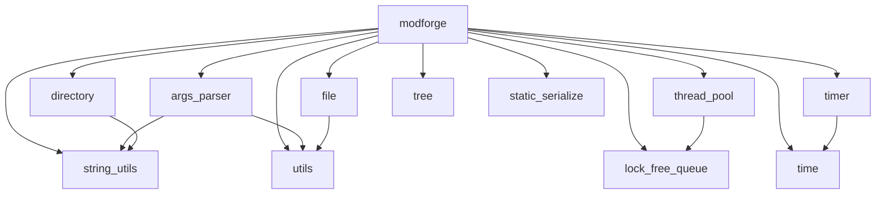

# ModForge

> Modern C++ Utility Library

一个基于现代 C++ 的通用基础库，提供容器、并发、文件、时间、字符串、静态反射序列化等常用模块。

## ✨ Features

- 🧩 模块化设计
- 🚀 现代 C++ / C++26
- 🧵 并发与无锁数据结构
- 🔍 C++26 静态反射
- 📦 无第三方依赖

## 📦 Modules

| 模块               | 说明                               | 状态 |
| ------------------ | ---------------------------------- | :--: |
| `args_parser`      | 命令行参数解析                     |  ✅   |
| `directory`        | 目录操作                           |  ✅   |
| `file`             | 文件操作                           |  ✅   |
| `lock_free_queue`  | SPSC / MPSC / SPMC / MPMC 无锁队列 |  ✅   |
| `thread_pool`      | 线程池                             |  ✅   |
| `time`             | 时间工具                           |  ✅   |
| `timer`            | 定时器                             |  ✅   |
| `string_utils`     | 字符串工具                         |  🚧   |
| `tree`             | 通用 N 叉树与索引树                |  🚧   |
| `static_serialize` | C++26 静态反射序列化               |  🚧   |
| `utils`            | 通用工具                           |  ✅   |

## 🔗 Module Dependencies

当前模块的实际依赖关系：



## 🗺️ Roadmap

### 基础工具

- [ ] Copy-on-Write

### 通信与事件

- [ ] Signal / Slot
- [ ] Event Bus

### 终端与配置

- [ ] Terminal Table
- [ ] Configuration

## 🔨 Build

项目使用 CMake 构建：

```bash
cmake -S . -B build
cmake --build build
```

## 🧪 测试

项目使用 CTest 进行测试。

```bash
ctest --test-dir build
```