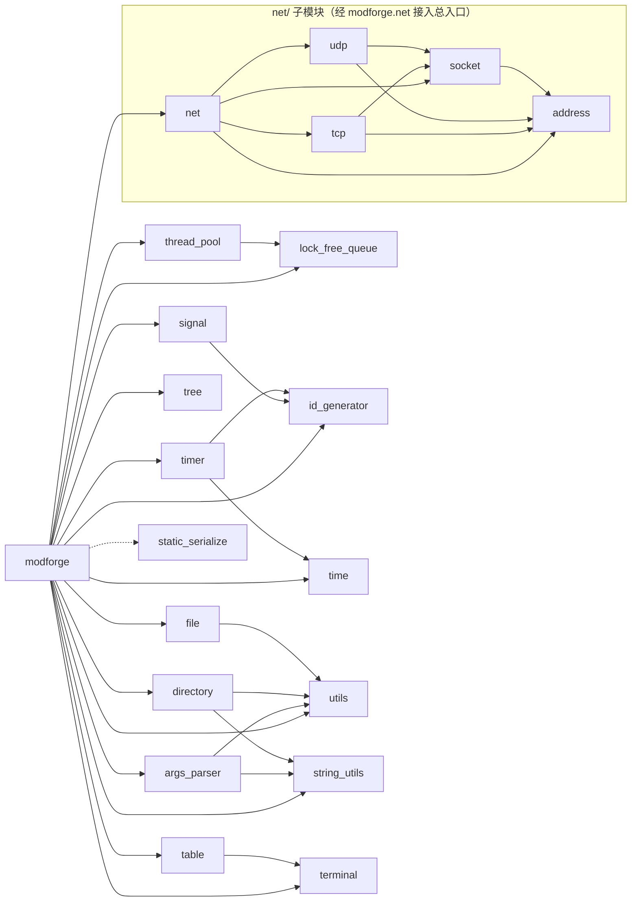

# ModForge

> Modern C++ Utility Library

一个基于现代 C++ 的通用基础库，提供容器、并发、文件、时间、字符串、静态反射序列化等常用模块。

## ✨ Features

- 🧩 以 C++20 modules 组织，全部通过 `import modforge;` 使用
- 🚀 现代 C++ / C++26，无第三方依赖
- 🧵 并发与无锁数据结构（SPSC / MPSC / SPMC / MPMC）
- 🔍 C++26 静态反射序列化（可选模块，默认关闭）
- 🧪 以单文件单测试函数方式维护模块测试
- 🛠️ 覆盖参数解析、文件系统、时间、线程池、定时器、树结构、信号、原子 id 生成器与终端辅助模块

## 📦 Modules

| 模块               | 说明                               | 状态 |
| ------------------ |------------------------------------| :--: |
| `args_parser`      | 命令行参数解析                     |  ✅   |
| `directory`        | 目录操作                           |  ✅   |
| `file`             | 文件操作                           |  ✅   |
| `lock_free_queue`  | SPSC / MPSC / SPMC / MPMC 无锁队列 |  ✅   |
| `id_generator`     | 原子递增 id 生成器（线程安全）      |  ✅   |
| `thread_pool`      | 线程池                             |  ✅   |
| `time`             | 时间工具（UTC / 本地时间、解析与格式化） |  ✅   |
| `timer`            | 定时器、协程定时器                 |  ✅   |
| `signal`           | 信号/回调机制                      |  ✅   |
| `terminal`         | 终端尺寸与光标控制                 |  ✅   |
| `table`            | 终端表格渲染                       |  ✅   |
| `string_utils`     | 字符串工具                         |  ✅   |
| `tree`             | 通用 N 叉树与索引树                |  ✅   |
| `utils`            | 通用工具                           |  ✅   |
| `static_serialize` | C++26 静态反射序列化               |  🔌   |
| `event`            | 事件模块（当前为空壳，未接入总入口） |  🚧   |
| `net/address`      | 网络端点（IPv4 + 端口）            |  ✅   |
| `net/socket`       | socket 底座：fd 生命周期与通用调用  |  ✅   |
| `net/tcp`          | 阻塞式 TCP（字节流 + 长度前缀分帧） |  ✅   |
| `net/udp`          | 阻塞式 UDP（数据报收发）           |  ✅   |
| `net/http`         | HTTP（当前为空壳）                 |  🚧   |
| `net/websocket`    | WebSocket（当前为空壳）            |  🚧   |

图例：✅ 默认构建 · 🔌 可选，需显式开启 · 🚧 占位未实现

> `net/` 的 `address / socket / tcp / udp` 通过 `modforge.net` **已接入总入口**——`import modforge;`
> 即可直接使用；`http` / `websocket` 仍是空壳，未导出。

## 🔗 Module Dependencies



虚线表示 `static_serialize` 仅在开启 `MODFORGE_ENABLE_REFLECTION` 时存在。
`net/` 的 `address / socket / tcp / udp` 通过 `modforge.net` 接入总入口（`import modforge;` 即得）；
`event` 仍未接入总入口，`http / websocket` 仍是空壳且未导出——用它们需单独 `import`。
`id_generator` 被 `signal` 与 `timer` 依赖，且经总入口对外导出。

## 🔨 Build

关闭反射时 GCC 16.2.1 与 GCC trunk（17.0.0 experimental）都可构建，测试全部通过；
需要反射模块时**必须**用 GCC trunk —— `std::meta` 等 C++26 反射设施在 16.2.1 的标准库中并不完整。

```bash
cmake -S . -B build -G Ninja -DCMAKE_CXX_COMPILER="/path/to/g++"
cmake --build build --target tests
ctest --test-dir build --output-on-failure
```

> `directory` 模块内置了一个轻量辅助模板 `path_string()`：用 `has_generic_display_string`
> concept 探测标准库能力，有 `generic_display_string()`（GCC 17）就走它，否则回退到
> `generic_string()`（GCC 16）。这样 GCC 16 不会有缺失符号、GCC 17 也不会触发 `generic_string()`
> 的弃用警告，关闭反射时两个版本都能干净构建。

## 🔌 可选模块

| 选项                          | 默认 | 影响的模块            |
|-----------------------------|------|------------------|
| `MODFORGE_ENABLE_REFLECTION` | OFF  | `static_serialize` |

命令行开启：

```bash
cmake -S . -B build-check -G Ninja -DMODFORGE_ENABLE_REFLECTION=ON
```

作为子项目引入时，在 `add_subdirectory()` 之前设置：

```cmake
set(MODFORGE_ENABLE_REFLECTION ON CACHE BOOL "" FORCE)
add_subdirectory(modforge)
```

关闭时 `static_serialize` 不参与编译，`test_static_serialize` 也不会注册到 CTest。
开启后 `-freflection` 会随 `modforge` 目标传递给下游，**下游整体将切入反射方言**——
不用反射的项目保持默认 OFF 即可，不受影响。

安装分发时反射能力在安装那一刻固化：通过 `find_package` 拿到的包是否带反射，
取决于安装时 `MODFORGE_ENABLE_REFLECTION` 的取值，消费方无需也无法在 `find_package` 之后切换。

## 📖 在项目中引入

`import std` 目前仍是实验特性，两项开关**必须在 `project()` 之前**设置，否则 configure 阶段就会报
`Experimental import std support not enabled`。推荐 include 库自带的 init 脚本
（自动按 CMake 版本选 UUID，源码树与安装包中都带）：

```cmake
cmake_minimum_required(VERSION 3.30.0)
include("/path/to/modforge/cmake/modforge-init.cmake")  # 必须在 project() 之前
project(my_app LANGUAGES CXX)
```

也可以手动设置（UUID 随 CMake 版本变化，见 `cmake/modforge-init.cmake`）：

```cmake
set(CMAKE_EXPERIMENTAL_CXX_IMPORT_STD "<UUID>")
set(CMAKE_CXX_MODULE_STD 1)
project(my_app LANGUAGES CXX)
```

### 方式一：add_subdirectory

```cmake
add_subdirectory(modforge)
target_link_libraries(my_app PRIVATE modforge)
```

### 方式二：find_package（需先安装）

先构建并安装 modforge（默认安装到 `/usr/local`，可用 `--prefix` 指定前缀）：

```bash
cmake --build <modforge构建目录>
cmake --install <modforge构建目录>                       # 安装到默认前缀
cmake --install <modforge构建目录> --prefix /your/prefix  # 或指定前缀
```

消费方工程（configure 时用 `-DCMAKE_PREFIX_PATH=/your/prefix` 指向安装前缀）：

```cmake
find_package(modforge CONFIG REQUIRED)
target_link_libraries(my_app PRIVATE modforge::modforge)
```

卸载（按构建目录里的 `install_manifest.txt` 删除安装产物）：

```bash
cmake --build <modforge构建目录> --target uninstall
```

#### find_package 下使用反射序列化

反射能力在**安装那一刻固化**：只有安装时以 `MODFORGE_ENABLE_REFLECTION=ON` 构建并安装，
`find_package` 拿到的包才带 `static_serialize`。消费方**不需要**（也无法）在自己的工程里开任何选项：

```bash
# 安装一个带反射的包
cmake -S . -B build -G Ninja -DMODFORGE_ENABLE_REFLECTION=ON
cmake --build build
cmake --install build --prefix /your/prefix
```

```cpp
import modforge;

// 接口与 add_subdirectory 方式完全一致，直接用即可
modforge::ArchivePointer ar(buf);
modforge::serialize(s, ar);
modforge::deserialize(s2, ar2);
```

两点注意：

- 包是否带反射，消费方代码可以用 `#ifdef MODFORGE_ENABLE_REFLECTION` 判断
  （该宏随 `modforge::modforge` 目标的接口自动传播到消费方编译）。
- 带反射的包会把 `-freflection` 自动传给消费方编译（含消费方自己的代码），
  因此消费方编译器**也必须支持 `-freflection`**（如 gcc-trunk 17）。

之后即可 `import modforge;` 使用，各模块的接口见 `src/*.cppm` 与 `tests/` 下对应的用例。

## 🧪 测试

项目使用 CTest，默认为 18 个用例，开启反射后为 19 个。

```bash
ctest --test-dir build-check --output-on-failure
```

| 测试 | 模块 |
| --- | --- |
| `test_args_parser` | `args_parser` |
| `test_directory` | `directory` |
| `test_file` | `file` |
| `test_lock_free_queue` | `lock_free_queue` |
| `test_string_utils` | `string_utils` |
| `test_time` | `time` |
| `test_timer` | `timer` |
| `test_thread_pool` | `thread_pool` |
| `test_tree` | `tree` |
| `test_utils` | `utils` |
| `test_signal` | `signal` |
| `test_event` | `event`（空测试） |
| `test_table` | `table` |
| `test_terminal` | `terminal` |
| `test_socket` | `net/socket` |
| `test_tcp` | `net/tcp` |
| `test_udp` | `net/udp` |
| `test_id_generator` | `id_generator` |
| `test_static_serialize` | `static_serialize`（🔌 可选） |

单个测试可直接运行：

```bash
./build-check/tests/tests test_timer
./build-check/tests/tests test_signal
./build-check/tests/tests test_tree
```

## 🗺️ Roadmap

### 基础工具

- [ ] Copy-on-Write

### 通信与事件

- [ ] Event Bus
- [ ] `event` 模块实体化（当前为空壳，且未接入总入口）

### 终端与配置

- [ ] Configuration

### 工程化

- [x] `find_package` 安装分发（install / export 规则）
