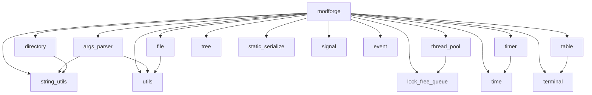

# ModForge

> Modern C++ Utility Library

一个基于现代 C++ 的通用基础库，提供容器、并发、文件、时间、字符串、静态反射序列化等常用模块。

## ✨ Features

- 🧩 模块化设计
- 🚀 现代 C++ / C++26
- 🧵 并发与无锁数据结构
- 🔍 C++26 静态反射
- 📦 无第三方依赖
- 🧪 以单文件单测试函数方式维护模块测试
- 🛠️ 覆盖参数解析、文件系统、时间、线程池、定时器、树结构、信号与终端辅助模块

## 📦 Modules

| 模块               | 说明                               | 状态 |
| ------------------ | ---------------------------------- | :--: |
| `args_parser`      | 命令行参数解析                     |  ✅   |
| `directory`        | 目录操作                           |  ✅   |
| `file`             | 文件操作                           |  ✅   |
| `lock_free_queue`  | SPSC / MPSC / SPMC / MPMC 无锁队列 |  ✅   |
| `thread_pool`      | 线程池                             |  ✅   |
| `time`             | 时间工具                           |  ✅   |
| `timer`            | 定时器                             |  ✅   |
| `signal`           | 信号/回调机制                     |  ✅   |
| `event`            | 事件模块                           |  ✅   |
| `terminal`         | 终端尺寸与光标控制               |  ✅   |
| `table`            | 终端表格渲染                     |  ✅   |
| `string_utils`     | 字符串工具                         |  ✅   |
| `tree`             | 通用 N 叉树与索引树                |  ✅   |
| `static_serialize` | C++26 静态反射序列化               |  ✅   |
| `utils`            | 通用工具                           |  ✅   |

## 🔗 Module Dependencies

当前模块的实际依赖关系：



## 🗺️ Roadmap

### 基础工具

- [ ] Copy-on-Write

### 通信与事件

- [ ] Event Bus

### 终端与配置

- [ ] Terminal Table
- [ ] Configuration

## 🔨 Build

项目使用 CMake 构建：

```bash
cmake -S . -B build
cmake --build build
```

当前项目已在 GCC trunk 环境中验证可用，推荐使用：

```bash
CC=/home/hexne/gcc-trunk/bin/gcc \
CXX=/home/hexne/gcc-trunk/bin/g++ \
cmake -S . -B build-check -G Ninja
cmake --build build-check --target tests
```

## 🧪 测试

项目使用 CTest 进行测试。

```bash
ctest --test-dir build
```

当前已覆盖的测试包括：

- `test_args_parser`
- `test_directory`
- `test_file`
- `test_lock_free_queue`
- `test_string_utils`
- `test_time`
- `test_timer`
- `test_thread_pool`
- `test_tree`
- `test_utils`
- `test_static_serialize`
- `test_signal`
- `test_event`
- `test_table`
- `test_terminal`

单个测试可直接运行：

```bash
./build-check/tests/tests test_timer
./build-check/tests/tests test_signal
./build-check/tests/tests test_tree
```